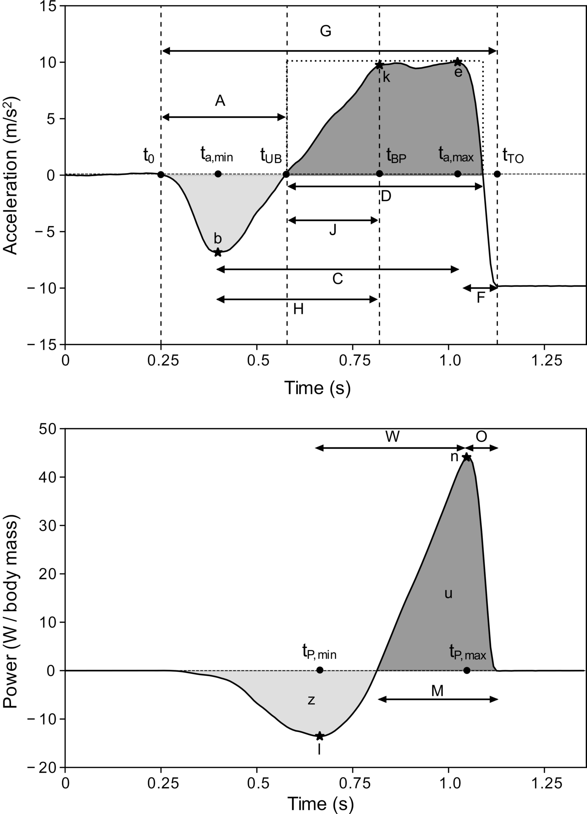

# Height Democratization of Jump Height estimates exploiting Smartphone IMU measures 

## Description

This repository contains the main code used for the jump height democratization analysis performed for the paper "*A Countermovement Jump Height Estimate Democratization Approach through Smartphone Measures*" by Mascia and Camomilla. 

The code here shared is so divided:

1. Feature extraction (written in GNU Octave/MATLAB language);
2. Feature selection (written in R language)

## Feature Extraction
The code extracts all those features which were biomechanically related to the jump itself (Dowling and Vamos, 1993; Mascia and Camomilla, 2021). Moreover, they included the three *central frequencies* extrapolated through Variational Mode Decomposition (Dragomiretskiy and Zosso, 2014). 

It must be noticed that the anthropometric features, described by four skinfold lengths, were not automatically computed through the presented algorithm, since they were manually measured by an external operator.

All the features, along with their description are listed in the table below.

|     ID     |     Feature                                                     |     Measure unit    |     Description                                                                                     |
|------------|-----------------------------------------------------------------|---------------------|-----------------------------------------------------------------------------------------------------|
|     Bi     |     Biceps skinfold                                             |     mm              |     Self-explanatory                                                                                |
|     Tr     |     Triceps skinfold                                            |     mm              |     Self-explanatory                                                                                |
|     Sc     |     Subscapular skinfold                                        |     mm              |     Self-explanatory                                                                                |
|     Ic     |     Superior-Anterior Iliac Crest skinfold                      |     mm              |     Self-explanatory                                                                                |
|     hSP    |     Jump height                                                 |     m               |     Height computed via TOV from aSP                                                                |
|     A      |     Unweighting phase duration                                  |     s               |     [t0, tUB]                                                                                       |
|     b      |     Minimum acceleration                                        |     m / s2          |     a(a, min)                                                                                      |
|     C      |     Time from minimum to maximum acceleration time              |     s               |     [ta, min, ta, max]                                                                              |
|     D      |     Main positive impulse time                                  |     s               |     Positive acceleration from tUB   until the last positive sample prior tTO                       |
|     e      |     Maximum acceleration                                        |     m / s2          |     a(ta, max)                                                                                      |
|     F      |     Time from acceleration positive peak to   take-off          |     s               |     [ta,max, tTO]                                                                                   |
|     G      |     Ground duration                                             |     s               |     [t0, tTO]                                                                                       |
|     H      |     Time from minimum acceleration to the end of B              |     s               |     [ta, min, tBP]                                                                                   |
|            |                                                                 |                     |                                                                                                     |
|     k      |     Acceleration at the end of the braking phase                |     m / s2          |     a(tBP)                                                                                          |
|     J      |     Time from negative peak velocity to the end of B          |     s               |     [tv, min, tBP]                                                                                  |
|     l      |     Negative peak power                                         |     W / kg          |     P(tP, min)                                                                                      |
|     M      |     Positive power duration                                     |     s               |     Self-explanatory                                                                                |
|     n      |     Positive peak power                                         |     W / kg          |     P(tP, max)                                                                                      |
|     O      |     Time distance between positive peak power and   take-off    |     s               |     [tP, max, tTO]                                                                                  |
|     p      |     Mean slope between acceleration peaks                       |     au              |     p = (e - b) / C                                                                                 |
|     q      |     Shape factor                                                |     au              |     Ratio between the area under the curve along D   and the one of a rectangle of sides D and e    |
|     r      |     Impulse ratio                                               |     au              |     r = b / e                                                                                       |
|     s      |     Minimum negative velocity                                   |     m / s           |     v(tv, min)                                                                                      |
|     u      |     Mean Concentric Power                                       |     W / kg          |     Self-explanatory                                                                                |
|     W      |     Power peaks delta time                                      |     s               |     [tP, min, tP, max]                                                                              |
|     z      |     Mean Eccentric Power                                        |     W / kg          |     Self-explanatory                                                                                |
|     f1     |     High central frequency                                      |     Hz              |     Highest central frequency computed through   VMD, associated with wobbling tissues and noise    |
|     f2     |     Middle central frequency                                    |     Hz              |     Middle central frequency computed through VMD,   associated with wobbling tissues               |
|     f3     |     Low central frequency                                       |     Hz              |     Lowest central frequency computed through VMD,   associated with the jump proper                |

<b>Table 1</b>: Detailed explanation of each of the analyzed features. Capital letters are for timings, small letters for the other parameters. Legend: au = arbitrary units; t0 = jump onset time; tUB = unbraking-braking phase transition time; tBP = braking-propulsion phase transition time; tTO = take-off time; ta, min = minimum acceleration time; ta, max = maximum acceleration time; tv, min = minimum velocity time; tP, min = minimum power time; tP, max = maximum power time.

<figure align = "center">

</figure>

<b>Figure 1</b>. Visual depiction, on a jump representative of the population, of the features selected. Acceleration-related features are shown in the top panel, while power-related ones in the bottom panel. The vertical dotted lines in the top panel represent jump-phases transitions (McMahon et al., 2019): the weighting phase lasts from the beginning to t0 (jump onset); the unweighting phase lasts from t0 to tUB; the braking phase lasts from tUB to tBP; the propulsion phase lasts from tBP to tTO. Notice that tUB and tv, min coincide. For the sake of clarity, only the former was depicted. Feature i cannot be represented as its numerical value was derived from further computations. The meaning of each feature is detailed in Table 1.

## Feature Selection

The best subset of features was chosen according to the best subset regression method (Hocking and Leslie, 1967). For each subset composed of $N$ features ($N = 1, \dots, M$), the combination giving the highest $R^2$ versus the gold standard values was stored. Then, a k-fold cross-validation paradigm ($k = 10$) was used to stress model generalization on each of the $M$ models obtained. Consequently, the best model among these $M$ was selected as the one presenting the lowest cross-validation error. For each feature included as a predictor in the selected model, the variance inflation factor ($VIF$) metrics was computed to face possible multicollinearity (Marquardt, 1970). A predictor presenting a $VIF > 10$ was considered linearly dependent to some of the others (Marquardt, 1970). Accordingly, if $VIF$ was above threshold, predictors were removed from the model, which was evaluated again excluding the specific multicollinear predictor until all remaining predictors satisfied the inclusion criteria ($VIF < 10$).

## References
Dowling, J. J., and Vamos, L. (1993). Identification of Kinetic and Temporal Factors Related to Vertical Jump Performance. Journal of Applied Biomechanics, 9(2), 95–110. https://doi.org/10.1123/jab.9.2.95

Dragomiretskiy, K., and Zosso, D. (2014). Variational Mode Decomposition. IEEE Transactions on Signal Processing, 62(3), 531–544. https://doi.org/10.1109/TSP.2013.2288675

Dragomiretskiy, K., and Zosso, D. (2014). Variational Mode Decomposition. IEEE Transactions on Signal Processing, 62(3), 531–544. https://doi.org/10.1109/TSP.2013.2288675

Marquardt, D. W. (1970). Generalized Inverses, Ridge Regression, Biased Linear Estimation, and Nonlinear Estimation. Technometrics, 12(3), 591. https://doi.org/10.2307/1267205

Mascia, G., and Camomilla, V. (2021). An automated Method for the Estimate of Vertical Jump Power through Inertial Measurement Units. ISBS Proceedings Archive, 39(1). https://commons.nmu.edu/isbs/vol39/iss1/74